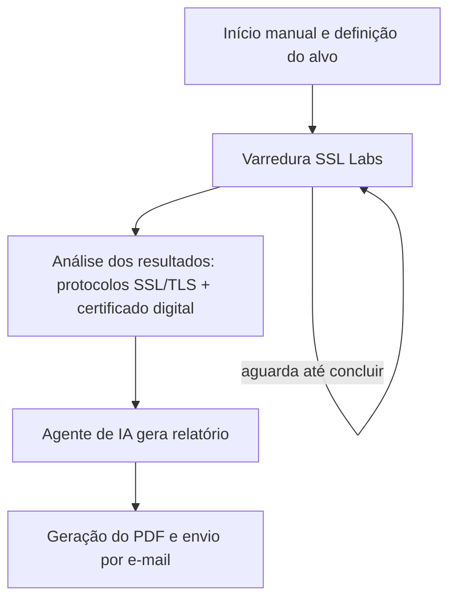

# PSIII — Auditoria Automatizada de Segurança SSL/TLS

**Automação de Diagnóstico de Vulnerabilidades com IA para Servidor Web**

**Equipe:** Gustavo Henrique da Silva Kubiack, Maria Eduarda Nichelle Ferreira, Rafael Francisco Gonçalves Serrano

Workflow n8n que analisa a segurança de um host (SSL/TLS, certificado digital), usa uma IA para interpretar os resultados e gera um relatório em PDF enviado por e-mail.

---

## Documentação

### Objetivo

Automatizar o diagnóstico de vulnerabilidades de segurança em servidores web, eliminando a análise manual repetitiva de configurações SSL/TLS e certificados digitais. O sistema coleta dados técnicos, utiliza uma IA para interpretá-los com senso crítico (classificando risco e priorizando recomendações) e entrega um relatório profissional em PDF diretamente por e-mail ao responsável pela auditoria.

### Arquitetura

O workflow segue uma arquitetura em pipeline, dividida em quatro etapas principais:

1. **Coleta** — definição do alvo e requisição de análise à API do SSL Labs, com espera em loop (*polling*) até a conclusão do escaneamento.
2. **Processamento** — os dados brutos retornados são analisados em paralelo por dois módulos independentes (protocolos/cifras e certificado digital) e depois unificados em um único contexto.
3. **Interpretação (IA)** — um agente de IA (LLM DeepSeek), orientado por um *system prompt* especializado e um parser de saída estruturada, transforma o contexto técnico em uma classificação de risco e um relatório em Markdown.
4. **Entrega** — o Markdown é convertido em HTML estilizado, transformado em PDF (via API externa) e enviado por e-mail ao destinatário configurado.

Essa separação em etapas isola a coleta de dados (determinística) da interpretação (probabilística, feita pela IA), facilitando manutenção e depuração de cada parte do fluxo.

### Tecnologias

| Categoria | Tecnologia | Uso no projeto |
|---|---|---|
| Orquestração | n8n (+ `@n8n/n8n-nodes-langchain`) | Motor de automação do workflow |
| Segurança / Coleta de dados | SSL Labs API (Qualys) | Varredura de protocolos, cifras e certificado |
| Inteligência Artificial | DeepSeek (LLM, via LangChain) | Análise dos achados e geração do relatório |
| Documentos | Markdown → HTML → PDF (PDFShift) | Formatação e geração do relatório final |
| Comunicação | E-mail (SMTP) | Envio do relatório ao responsável |
| Lógica customizada | JavaScript (nós Code do n8n) | Normalização de dados, regras de análise e montagem do HTML |

---

## Fluxo

O processo é acionado manualmente, coleta os dados de segurança do host, processa-os, envia à IA para interpretação e finaliza com o envio do relatório em PDF por e-mail:

1. **Início e definição do alvo**: o fluxo é disparado manualmente e o hostname a ser analisado é configurado.
2. **Varredura SSL Labs**: solicita uma análise à API do SSL Labs e aguarda em loop até que o processamento esteja concluído.
3. **Análise dos dados**: os resultados são processados em paralelo — verificação de protocolos SSL/TLS e análise do certificado digital — e depois unificados.
4. **Interpretação por IA**: um agente de IA (modelo DeepSeek) analisa os dados técnicos e gera um relatório em Markdown, com classificação de risco e recomendações, usando um parser de saída estruturada.
5. **Geração e envio do relatório**: o Markdown é convertido em HTML, transformado em PDF e enviado por e-mail ao destinatário configurado.

### Diagrama do processo

*(Diagrama de alto nível — o detalhamento nó a nó está disponível em `relatorio-no-a-no-PSIII.md`.)*

---

## Principais integrações

- **SSL Labs API** — coleta de dados técnicos de SSL/TLS.
- **DeepSeek (via LangChain/n8n)** — geração do relatório de análise.
- **PDFShift** — conversão do relatório HTML em PDF.
- **E-mail (SMTP)** — envio do relatório final ao destinatário.

## Requisitos

- Instância n8n com os pacotes `@n8n/n8n-nodes-langchain` instalados.
- Credenciais configuradas para: SSL Labs (não requer chave, mas respeita rate limit), DeepSeek (API key), PDFShift (API key) e envio de e-mail (SMTP).

## Como usar

1. Importe o arquivo `PSIII.json` no n8n.
2. Configure as credenciais dos serviços acima.
3. Ajuste o hostname alvo no nó de definição do alvo, se necessário.
4. Execute o fluxo manualmente pelo gatilho inicial.
